# Hey, I'm Pedro · `CokieMiner`

Physics student @ FCUP who builds the tools he wishes existed

---

### What I do

I write scientific software in Rust because Python was too slow and I was too stubborn.
My main project is **SymbAnaFis**, a symbolic math engine with a register-VM evaluator, SIMD batch evaluation, symbolic differentiation, and Python bindings via PyO3.
It started as a curve-fitting helper and turned into a full CAS. These things happen.

On the side I flash Linux distros (I use Arch btw) more often than I should, and occasionally lose weeks to Minecraft factory automation (Greg it all).

---

### Projects

| | Project | What it is |
|---|---|---|
| 🦀 | [**SymbAnaFis**](https://github.com/CokieMiner/SymbAnaFis) | Symbolic differentiation, simplification & high-performance evaluation engine for Rust + Python |
| 🖥️ | [**Anafis-Tauri**](https://github.com/CokieMiner/Anafis-Tauri) | Desktop Tauri app for uncertainty-aware statistical analysis with custom backends |
| 🐍 | [**AnaFis**](https://github.com/CokieMiner/AnaFis) | Simple repackage of Python tools for curve fitting and GUM-compliant uncertainty propagation with a GUI |
| 🏆 | [**SciTech**](https://github.com/CokieMiner/SciTech) | Scitech 2025 winner |

---

### Stack & interests

Things I find interesting: symbolic computation · SIMD · JIT · exact real arithmetic · systems engineering · statistical analysis (Bayesian btw) · compilers

---

### Stats

---

he/him · Porto · currently distro-hopping and pretending it's productive instead of building or studying for my degree
